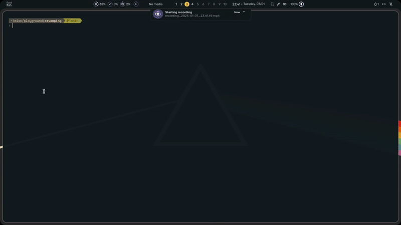
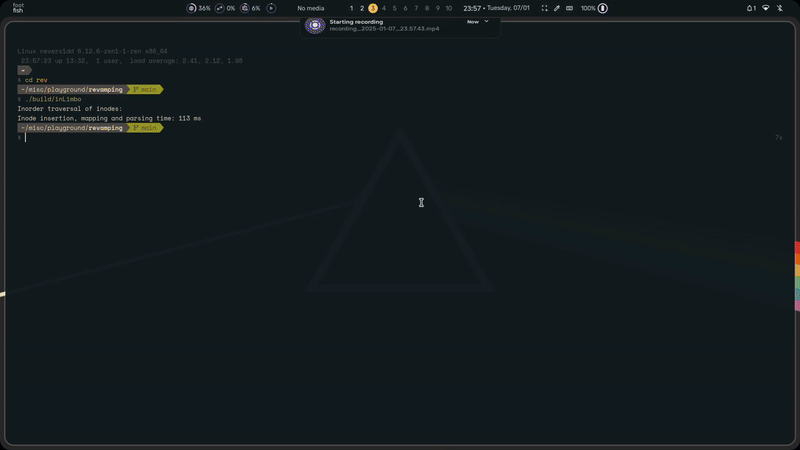

<div align="center">
  
</div>

<div align="center">
  <h1 style="font-weight: bold; font-size: 3em; color: #3498db;">inLimbo</h1>
</div>

<p align="center">
  
  
  
</p>

----

> [!IMPORTANT]
> 
> inLimbo is a WIP
> 
> Most aspects of the project are under heavy development
> and no stable release is present as of yet.
> 

A possible revamp of LiteMus

## Features

- **Fully configurable**: Keybinds, library, FTP credentials, and more, all in one `config.toml` file located in `$HOME/.config/inLimbo/config.toml`
- **Very fast and easy to use**: Optimized for speed and usability.
- **Very few external dependencies**: Minimal setup required to get started.
- **Clean and nice TUI experience**: Interact with your music library seamlessly in a terminal interface.
- **Showcases all the metadata**: Displays song metadata, including lyrics, genre, and more, for every file in your library.
- **Plays and caters to many audio file formats**: Compatible with a variety of audio formats, depending on the capabilities of [miniaudio](https://github.com/mackron/miniaudio).
- **Customizable**: Add your own color palette to inLimbo ;)

## LOOKS

<div align="center">
  
</div>

## GOAL

The goal of this project is just to find peace and solitude for me as I try to create something I wanted for a long time

Here are a few novelties that may or may not have been added yet:

1. Cool and amazing TUI experience thanks to FTXUI 
2. Full use of metadata (lyrics, genre, etc..) and available for display 
3. Simple and easy network transfer of your favourite songs over to another device
4. Fast and efficient loading of your song directory with everything you need :)
5. TUI over the web?? (Why would you want this)

## BUILDING

You will need CMake for this (and git obvi)

```bash
git clone https://github.com/nots1dd/inLimbo.git 
cd inLimbo/
./init.sh # to initialize the repository with some important headers
```

Then building commands: (**WILL NOT COMPILE IF `init.sh` IS NOT RUN FIRST**)

```bash
cmake -S . -B build/
cmake --build build/
./build/inLimbo
```

To build its web-assembly, you will need [emscripten](https://github.com/emscripten-core/emscripten)

> [!IMPORTANT]
> 
> Building the web-assembly:
> 
> Currently I am not sure how to include and compile taglib
> into wasm so currently the web build may compile but it will 
> not work as I have dummy methods set up for EMSCRIPTEN build 
> (else it wont even compile to wasm)
> 

```bash 
mkdir build_emscripten && cd build_emscripten 
emcmake cmake ..
make -j
./run_webassembly.py # assuming the compilation has no errors
# This will run in port 8000
```

> [!NOTE]
> 
> To try debug build check out [DEBUGGING](https://github.com/nots1dd/inLimbo?tab=readme-ov-file#debugging)
> 

## DEBUGGING

inLimbo is in active development and is prone to having *A LOT* of issues

To try out **DEBUG BUILD** to find bugs/issues:

```bash 
mkdir build-dbg/
cd build-dbg/
cmake -DCMAKE_BUILD_TYPE=Debug ..
make
```

The **DEBUG BUILD** will account for the following issues:

-> Threads

-> Address Sanitation (ASan)

-> Undefined Behaviour Sanitation (UBSan)

## CONFIGURATION

There is quite a lot to configure in the inLimbo project. A basic config file will be setup in your `$HOME/.config/inLimbo/` directory while using CMake to build

> [!IMPORTANT]
> 
> Check out [config.toml](https://github.com/nots1dd/inLimbo/blob/main/src/parser/examples/config.toml) to see all the possible fields
> for configuration 
> 
> **IT IS UNDER HEAVY DEVELOPMENT SO EXPECT BREAKING CHANGES WITH EACH COMMIT**
>

**COLORS FORMAT**

-> Hexadecimal `#RRGGBB` format 

-> TrueColors (Solid predefined colors):

> [!NOTE]
> 
> For TrueColors, check out [COLORS](https://github.com/nots1dd/inLimbo/blob/main/COLORS.md) for more information on how to set up colors in `inLimbo`
> 

<div align="center">
  
</div>

## DIRECTORY SORTING 

Currently uses `rbtrees` and `unordered_map` to store and write the current inodes in given directory to `lib.sync` file 

-> rbtree will contain all the inodes at runtime

-> cached to `lib.sync` for future use and faster data fetch

To test out the creation of the song map of your chosen directory:

```bash
cd src/dirsort/
make
./dirsort-test # change the directory in $HOME/.config/inLimbo/config.toml to test out
```

> [!NOTE]
> 
> src/dirsort/ has the current implementation of
> how the chosen songs directory will be cached and 
> read into memory to display in ftxui TUI
> 
> To use dirsort/ source files separately:
> 
> ```bash 
> make
> ```
> 

## CREDITS

**LOGO**:

*DISCLAIMER*: This is not an original logo nor was it commisioned by me

It is a basic stock image found online. I got it from [here](https://unsplash.com/photos/black-and-white-decor-FrQKfzoTgsw)

**TOML PARSER**:

To parse the [config.toml](https://github.com/nots1dd/inlimbo/blob/main/src/parser/examples/config.toml) is thanks to [TOML++](https://github.com/marzer/tomlplusplus)

**AUDIO PLAYBACK & API**:

Audio playback and capture is thanks to [miniaudio](https://github.com/mackron/miniaudio)

----

inLimbo is Free and Open Source Software Licensed under [GNU GPL v3](https://github.com/nots1dd/inlimbo/blob/main/LICENSE)
