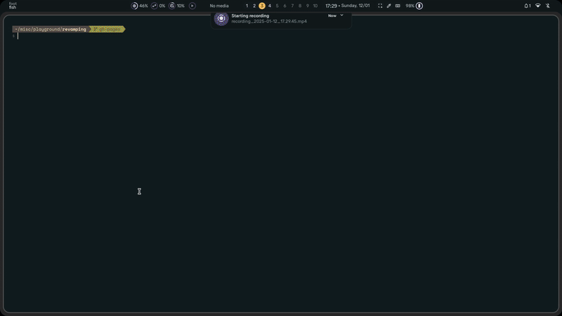
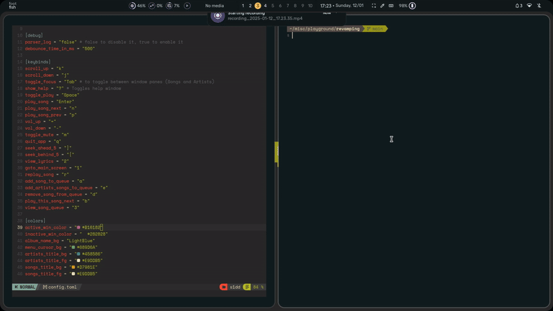

<div align="center">
  
</div>

<div align="center">
  <h1 style="font-weight: bold; font-size: 3em; color: #3498db;">inLimbo</h1>
</div>

<p align="center">
  
  
  
</p>
<p align="center">
  <a href="https://nots1dd.github.io/inLimbo">Documentation</a> ·
  <a href="https://github.com/nots1dd/inLimbo?tab=readme-ov-file#features">Features</a> ·
  <a href="https://github.com/nots1dd/inLimbo?tab=readme-ov-file#looks">Looks</a> .
  <a href="https://github.com/nots1dd/inLimbo?tab=readme-ov-file#building">Get Started</a> ·
  <a href="https://github.com/nots1dd/inLimbo/issues">Report a bug</a>
</p>

> [!WARNING]
> 
> inLimbo is a WIP
> 
> Most aspects of the project are under heavy development
> and no stable release is present as of yet.
> 

The inLimbo project aims to be a new upcoming TUI music player for UNIX based systems that gives music lovers a clean and efficient environment to browse, play and interact with your favourite offline music.

## **Why**

There are a dozen of great music players out there that do a really good job of making my music experience top notch, but nothing was ever perfect. So I tried making something that in my opinion comes closest to my ideal TUI music player.

Why would you want to stay in Limbo?

Sometimes it feels good to be stuck in a weird place in your life, and it feels even better to be stuck in Limbo with music :)

## **Features**

- **Fully configurable**: Keybinds, library, FTP credentials, and more, all in one `config.toml` file located in `$HOME/.config/inLimbo/config.toml`
- **Very fast and easy to use**: Optimized for speed and usability. (Supports vim keybindings and CMUS like song traversal)
- **Versatile**: Aside from the TUI, a lot of support is available from its CLI as well for faster fetch of your desired data.
- **Very few external dependencies**: Minimal setup required to get started.
- **Clean and nice TUI experience**: Interact with your music library seamlessly in a terminal interface.
- **Caters to a lot of audio files**: The project is kept in mind to support for popular audio formats like `MP3`, `FLAC`, `OGG`, `WAV`, `M4A`, etc. which adds to inLimbo's flexibility and power
- **Showcases all the metadata**: Displays song metadata, including lyrics, genre, and more, for every file in your library. (Will allow even embedding in the future)
- **Customizable**: Heavily customizable TUI with custom keybinds, colors, UI designs and much more to come...
- **Privacy**: No data is collected by inLimbo other than a backtrace of when the application catches a critical signal like `SIGSEGV`, `SIGABRT`
- **Security**: Code has thorough scrutiny for any forms of vulnerability through CodeQL CI, GoogleTest Suite and better C++ coding practices. The application also ensures basic security features like binding to a Unix domain socket to ensure single instance spawn, very verbose debugging, ASan & TSan debug builds for further analysis of the inLimbo project binaries.

## **LOOKS**

Demo Video at [here](https://github.com/nots1dd/inLimbo/blob/main/assets/inLimboDemo.mkv)

<details>
  <summary>Click to view demo</summary>
  <video controls>
  <source src="assets/inLimboDemo.mp4" type="video/mp4">
  Your browser does not support the video tag.
  </video>
</details>

<div align="center">
  
  
</div>

## **DEPENDENCIES** 

> [!IMPORTANT]
> 
> It is **HIGHLY** recommended to have FFmpeg installed in your system 
> 
> This is required for testing purposes (`./tests/`), and in the future, inLimbo may have features to embed your desired metadata to an audio file. 
> 

| Dependency      | Ubuntu                    | Fedora                        | Arch Linux                   |
|-----------------|---------------------------|-------------------------------|------------------------------|
| **TagLib**      | `libtag1-dev`             | `taglib-devel`                | `taglib`                     |
| **Gio**         | `libgio-2.0-dev`          | `glib2-devel`                 | `glib2`                      |
| **GLib**        | `libglib-2.0-dev`         | `glib2-devel`                 | `glib2`                      |
| **pkg-config**  | `pkg-config`              | `pkgconf`                     | `pkgconf`                    |
| **ImageMagick** | `imagemagick`             | `ImageMagick`                 | `imagemagick`                |
| **X11**         | `libx11-dev`              | `libX11-devel`                | `libx11`                     |
| **PNG**         | `libpng-dev`              | `libpng-devel`                | `libpng`                     |
| **cereal**      | `libcereal-dev`           | `libcereal-devel`             | `cereal`                     |

> [!NOTE]
> 
> If cereal is **NOT** available in your linux distribution,
> 
> ```bash
> git clone https://github.com/USCiLab/cereal.git # download cereal 
> mv cereal/include/* /usr/include/ # moves include/cereal headers to your include directory 
> # If you find that risky, just modify CMakeLists.txt to include cereal's directory for building
> ```
> 

**FTXUI** is fetched from GitHub [here](https://github.com/ArthurSonzogni/FTXUI/) itself during building so **NO** need to install it separately.

## **GOAL**

The goal of this project is just to find peace and solitude for me as I try to create something I wanted for a long time

Here are a few novelties that may or may not have been added yet:

1. Cool and amazing TUI experience thanks to FTXUI 
2. Full use of metadata (lyrics, genre, thumbnail, etc..) and available for display 
3. Simple and easy network transfer of your favourite songs over to another device
4. Fast and efficient loading of your song directory with everything you need :)
5. TUI over the web?? (Why would you want this)
6. Active testing of the codebase using GTest Suite
7. Security ensured using CodeQL workflow

## **BUILDING**

> [!IMPORTANT]
> 
> inLimbo has been **TRIED AND TESTED** in the following GNU/Linux distros:
> 
> 1. Arch Linux (x86-64 arch)
> 2. Ubuntu (x86-64 arch)
> 3. Fedora/Nobara Linux (x86-64 arch)
> 
> As long as your distribution can install & build the requirements, there should *NOT* be any issue
> 

You will need CMake and Make (GNU Make for BSD) for this (and git obvi)

A simple command using makefile should build everything you want:

```bash 
make build-all
```

For a **GLOBAL BUILD**:

```bash 
make build-global
```

Check out [BUILD.md](https://github.com/nots1dd/inLimbo/blob/main/BUILD.md) for more options to build targets

> [!NOTE]
> 
> To try debug build check out [DEBUGGING](https://github.com/nots1dd/inLimbo?tab=readme-ov-file#debugging)
> 

# **Getting Started with inLimbo**

## Running inLimbo

To get started with **inLimbo**, run the following command:

```bash
inLimbo # or wherever you have built the binary
```

> [!IMPORTANT]
> 
> inLimbo acquires a Unix domain socket binding on runtime at `/tmp/inLimbo.sock`
> 
> This is to ensure that multiple instances **CANNOT** run at the same time (avoids a lot of complications especially with DBus interfacing)
> 

To get help regarding the command-line arguments available with inLimbo, you can use the `--help` option:

```bash
inLimbo --help
```

## Cache and Directory Management

If you update the song directory in `config.toml`, **inLimbo** does not automatically remove the static serialized `lib.bin` file, which is used to load the song map. 

To ensure that **inLimbo** loads the directory dynamically, use the following command:

```bash
inLimbo --update-cache-run
```

You can also merge the dynamic load with other arguments like so:

```bash 
inLimbo --update-cache-run --print-song-tree # will create a new song map and print it regardless of lib.bin data
```

Note that this will result in slower song map times as the song map is generated dynamically on each run.

## **Command-Line Arguments**

- `--help`
**Description**: Display help information about available arguments for inLimbo.

- `--version`
**Description**: Display the version number of inLimbo.

- `--clear-cache`
**Description**: Clear cached data, which includes the song map and other temporary data stored by the application.

- `--show-config-file`
**Description**: Display the path to the configuration file used by inLimbo.

- `--show-log-dir`
**Description**: Show the directory path where logs are stored for inLimbo.

- `--show-dbus-name`
**Description**: Show the DBus service name used by inLimbo.

- `--update-cache-run`
**Description**: Update the cache file and run the application. This will make inLimbo load the directory dynamically every time (note that this will result in slower song map times).

- `--print-song-tree`
**Description**: Print the song map parsed from the directory. This shows the structure of the song tree and how songs are organized.

- `--print-artists-all`
**Description**: Print all parsed artists from the song map. This will list all artists found in the directory and their corresponding songs.

- `--print-songs-by-artist`
**Description**: Print all the songs of a given artist. This argument requires you to specify the artist’s name, and it will list all songs by that artist.

- `--print-songs-by-genre-all`
**Description**: Print all parsed genres and their song mappings. This will show all the genres available in the song map and list songs under each genre.

- `--print-song-info`
**Description**: Print every parsed information (even default info) regarding a song (Arguments: Can take **SONG NAME** or **FILE PATH**)

- `--socket-info`
**Description**: Prints the information about the Unix domain socket binding of inLimbo 

- `--socket-unlink-force`
**Description**: Forcibly removes (unlinks) the Unix domain socket binding even if the application is running

> [!NOTE]
> 
> To utilize these arguments to the fullest, it is **HIGHLY** recommended to use something like `less`/`bat`
> that allows for neat terminal output traversal (will allow for you to view the entire song tree parsing)
> 
> ```bash 
> inLimbo --print-song-tree | bat # an example of using bat to view the song tree (can traverse the output easily)
> ```
> 
> This ensures that you do not have any struggle with viewing the entire console output.
> 

There will be more command-line arguments in the future...

## **CONFIGURATION**

There is quite a lot to configure in the inLimbo project. A basic config file will be setup in your `$HOME/.config/inLimbo/` directory while using CMake to build

> [!IMPORTANT]
> 
> Check out [config.toml](https://github.com/nots1dd/inLimbo/blob/main/src/parser/examples/config.toml) to see all the possible fields
> for configuration 
> 
> **IT IS UNDER HEAVY DEVELOPMENT SO EXPECT BREAKING CHANGES WITH EACH COMMIT**
>

**COLORS FORMAT**

-> Hexadecimal `#RRGGBB` format 

-> TrueColors (Solid predefined colors):

> [!NOTE]
> 
> For TrueColors, check out [COLORS](https://github.com/nots1dd/inLimbo/blob/main/COLORS.md) for more information on how to set up colors in `inLimbo`
> 

**DEFAULT KEYBINDS**

### **General Navigation**
| Keybind | Action |
|---------|--------|
| `q` | **Quit the application** |
| `Tab` | **Toggle focus** between the "Artists" and "Songs" panes |
| `?` | **Show or hide the help menu** |
| `/` | **Open the search menu** |

### **Scrolling and Selection**
| Keybind | Action |
|---------|--------|
| `j` | **Scroll down** (move selection down in the list) |
| `k` | **Scroll up** (move selection up in the list) |
| `0` | **Move to the next search result** (if search is active) |
| `9` | **Move to the previous search result** (if search is active) |

### **Playback Controls**
| Keybind | Action |
|---------|--------|
| `Space` | **Toggle play/pause** for the currently playing song |
| `Enter` | **Play the currently selected song** |
| `n` | **Play the next song** in the queue |
| `p` | **Play the previous song** in the queue |
| `r` | **Replay the current song** |
| `m` | **Toggle mute** on/off |

### **Seeking and Volume Control**
| Keybind | Action |
|---------|--------|
| `h` | **Seek backward by 5 seconds** |
| `l` | **Seek forward by 5 seconds** |
| `=` | **Increase volume** |
| `-` | **Decrease volume** |
| `w` | **Toggle between available audio devices** |

### **Song and Queue Management**
| Keybind | Action |
|---------|--------|
| `a` | **Add the currently selected song to the queue** |
| `e` | **Add all songs of the selected artist to the queue** |
| `b` | **Play this song next** (insert it into the queue immediately after the current song) |
| `d` | **Remove the currently selected song from the queue** |
| `3` | **View the current song queue** |

### **Song Information and UI Navigation**
| Keybind | Action |
|---------|--------|
| `1` | **Go to the main UI screen** |
| `2` or `L` | **View lyrics of the currently playing song** |
| `i` | **View detailed information about the current song** |

### **Status Bar & UI Settings**
| Keybind | Action |
|---------|--------|
| `true/false` (UI setting) | **Show or hide bitrate information** in the status bar |


<div align="center">
  
</div>

## **DEBUGGING**

inLimbo is in active development and is prone to having *A LOT* of issues

-> Makefile also allows for building and running of a debug build.

To try out **DEBUG BUILD** to find bugs/issues:

1. Debug build with `AddressSanitizer` (ASan):

```bash 
mkdir build-dbg/
cd build-dbg/
cmake -DCMAKE_BUILD_TYPE=Debug-ASan ..
make
./inLimbo-DBG-Asan
```

2. Debug build with `Thread Sanitizer` (TSan):

```bash 
mkdir build-dbg/
cd build-dbg/
cmake -DCMAKE_BUILD_TYPE=Debug-TSan ..
make
./inLimbo-Debug-Tsan
```

The **DEBUG BUILD** will account for the following issues:

-> Threads

-> Address Sanitation (ASan)

-> Undefined Behaviour Sanitation (UBSan)

## **DIRECTORY SORTING**

inLimbo reads a directory and attempts to parse each inode for its metadata using TagLib, and accordingly creates a song map datastructure that is utilized to efficiently traverse the required artist, album, song etc.

To know more about inLimbo Project's logical flow on creating a song map, visit [SONGMAP](https://github.com/nots1dd/inLimbo/blob/main/src/dirsort/SONGMAP.md)

## **TESTING** 

The inLimbo project is aiming to be more aware of how bad its codebase is, hence I am setting up unit tests for most if not all functions/classes that should:

1. Give more clarity on how the logical flow of the function/class works in a test suite 
2. Logical flaws and boundary conditions going unchecked can be understood better
3. Should give more confidence in the code structure if such tests pass 

The testing is done using GTest, read [TESTS.md](https;//github.com/nots1dd/inLimbo/blob/main/tests/TESTS,md) to understand more on how tests are configured and built

## **DOCUMENTATION**

There is a primitive Doxygen documention set up for the inLimbo project, that should explain a lot more about the thought process and idea behind every aspect of the codebase.

To generate and view doxygen documentation locally:

```bash 
doxygen .Doxyfile # ensure that you have doxygen installed first 
cp -r assets/gifs/ docs/
cp index.html docs/
firefox docs/html/index.html # or any web browser (xdg-open also works)
```

It is much easier to use the script `make_docs.sh`

```bash
./make_docs.sh
```

### Manual Page

You can always refer to the man-page: (**Ensure that you have manpage-dev package installed**)

```bash 
man inLimbo
```

It should provide with an in-depth documentation of everything you need.

Or you could just visit [inLimbo Website](https://nots1dd.github.io/inLimbo/)

## CREDITS

**LOGO**:

*DISCLAIMER*: This is not an original logo nor was it commisioned by me

It is a basic stock image found online. I got it from [here](https://unsplash.com/photos/black-and-white-decor-FrQKfzoTgsw)

**TOML PARSER**:

To parse the [config.toml](https://github.com/nots1dd/inlimbo/blob/main/src/parser/examples/config.toml) is thanks to [TOML++](https://github.com/marzer/tomlplusplus)

**AUDIO PLAYBACK & API**:

Audio playback and capture is thanks to [miniaudio](https://github.com/mackron/miniaudio)

**INSPIRATIONS**:

This music player's UI flow is heavily inspired by [CMUS](https://github.com/cmus/cmus), it seemed (to me atleast) the fastest and most responsive and logical UI/UX design of a TUI that has a great balance between looking good and feeling smooth

inLimbo is Free and Open Source Software Licensed under [GNU GPL v3](https://github.com/nots1dd/inlimbo/blob/main/LICENSE)
