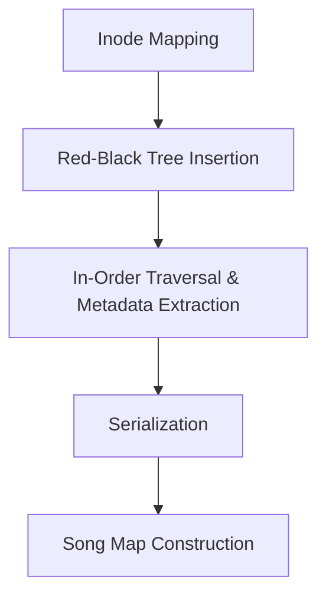
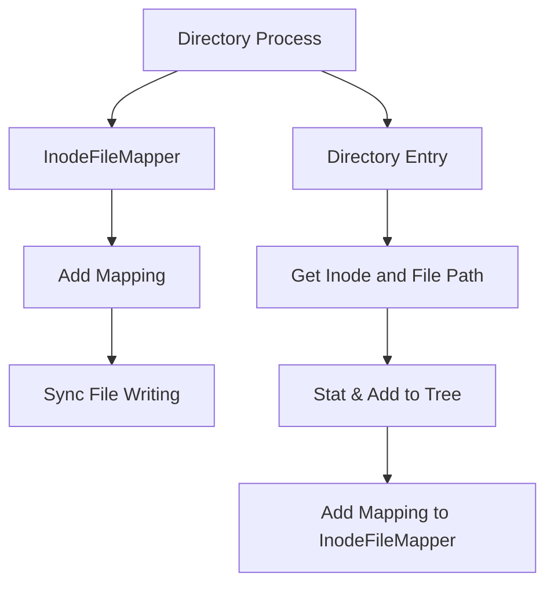
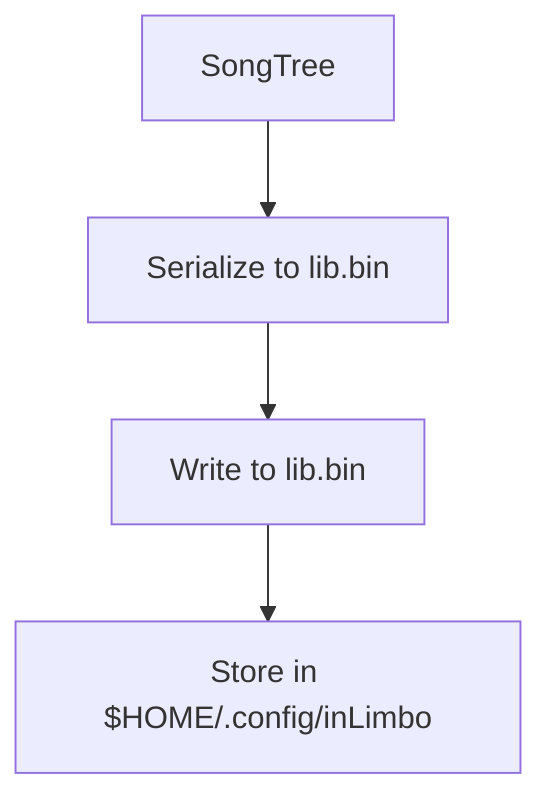

# **inLimbo Music Player - Song Map Flow**

This document explains the flow of acquiring the song map in the **inLimbo Music Player**. The process involves mapping inodes to file paths, traversing a Red-Black Tree (RBT) to organize song metadata, and eventually serializing the data into a binary file that can be parsed by the UI. Below is a step-by-step diagrammatic explanation of the flow, which includes how the inodes are mapped, metadata is processed, and the final song map is prepared for display.

---

## **High-Level Flow Overview**



The process of acquiring and displaying the song map follows these general stages:

1. **Inode Mapping** - We map the inodes of all music files in a directory to their respective file paths.
2. **Red-Black Tree (RBT) Insertion** - We use the inodes to insert nodes into a Red-Black Tree to maintain an ordered structure.
3. **Metadata Extraction** - Once the tree is populated, we traverse it in an inorder fashion and extract metadata from the files using `TagLibParser`.
4. **Serialization** - The parsed metadata is serialized into a binary file (`lib.bin`) for easy access.
5. **Song Map Construction** - The song map is created and used by the UI to display music files.

---

## **Step-by-Step Detailed Flow**

### **1. Inode Mapping with `InodeFileMapper`**
We begin by processing directories and mapping inodes to their respective file paths. This is achieved through the `InodeFileMapper` class, which stores the mappings in an internal `unordered_map` and writes them to a synchronization file (`lib.sync`).



1. **Process Directory**: The `processDirectory` function reads each file in the specified directory, retrieves the inode using `stat()`, and adds it to the Red-Black Tree.
2. **Add Mapping**: Each inode is mapped to its file path using the `addMapping` method of `InodeFileMapper`.

---

### **2. Inode Insertion into Red-Black Tree**
The inodes obtained from the previous step are inserted into a Red-Black Tree (`RedBlackTree` class) to maintain a balanced structure.

```mermaid
graph TD
    A[Red-Black Tree] --> B[Insert Inode]
    B --> C[Fix Tree Balancing]
    C --> D[Tree Balancing (fixInsert)]
    B --> E[Node (Inode Data)]
    E --> F[Left, Right Child, Color (RED/BLACK)]
```

1. **Insert**: Each inode is inserted into the `RedBlackTree` via the `insert()` method.
2. **Balancing**: After each insertion, the tree is balanced using the `fixInsert()` method to ensure that Red-Black Tree properties (such as node color and structure) are maintained.

---

### **3. In-Order Traversal and Metadata Extraction**
Once the tree is populated, we traverse it in an inorder fashion. During this traversal, we extract metadata for each file using the `TagLibParser` class. This metadata typically includes information such as the song title, artist, album, and more.

```mermaid
graph TD
    A[Red-Black Tree] --> B[In-Order Traversal]
    B --> C[Extract Song Metadata]
    C --> D[Add Metadata to SongTree]
    C --> E[TagLibParser]
    E --> F[Parse File Information]
    F --> G[Store Metadata in SongTree]
    B --> H[Node (Inode Data)]
    H --> I[Metadata Extraction]
```

1. **In-Order Traversal**: We perform an inorder traversal of the Red-Black Tree (`inorderHelper()` method).
2. **Extract Metadata**: For each inode, we use `TagLibParser` to extract metadata from the corresponding file (song title, artist, etc.).
3. **Add Song to SongTree**: The parsed metadata is added to a `SongTree`, which stores the songs in a structured manner.

---

### **4. Serialization into `lib.bin`**
After collecting the song metadata, we serialize the data into a binary file (`lib.bin`). This file is saved in the user's home directory (`$HOME/.config/inLimbo`) for future use.



1. **Serialize**: The `SongTree` is serialized into the `lib.bin` file for persistent storage.
2. **Store**: The serialized binary data is stored in the `$HOME/.config/inLimbo/` directory.

---

### **5. UI Parsing the Song Map**
Finally, the `lib.bin` file is loaded by the UI, which parses the data structure to provide an interactive and user-friendly interface for browsing and controlling the music files.

```mermaid
graph TD
    A[UI] --> B[Parse lib.bin]
    B --> C[Display Song Map]
    C --> D[Song Map (UI View)]
    D --> E[Display Metadata]
```

1. **Parse lib.bin**: The UI parses the `lib.bin` file to retrieve the stored song metadata.
2. **Display Metadata**: The parsed song metadata is presented in the UI for the user to interact with.

---

> [!NOTE]
> 
> Some stats about loading songs in a serialized way:
> 
> **IT IS INCREDIBLY FAST** 
> For ~300 songs it takes these average times:
> 
> 1. 12-15ms -- Deserializing `lib.bin` as a cache file (static load of songmap)
> 2. 180-200ms -- Loading the song directory, storing and parsing each inode (dynamic load of songmap)
> 

## **Conclusion**
The flow from mapping inodes to building the song map is a multi-step process involving directory traversal, inode mapping, Red-Black Tree insertion, metadata extraction, serialization, and finally UI display. This ensures that **inLimbo** can efficiently process and manage large music libraries, making metadata accessible in a user-friendly manner.
